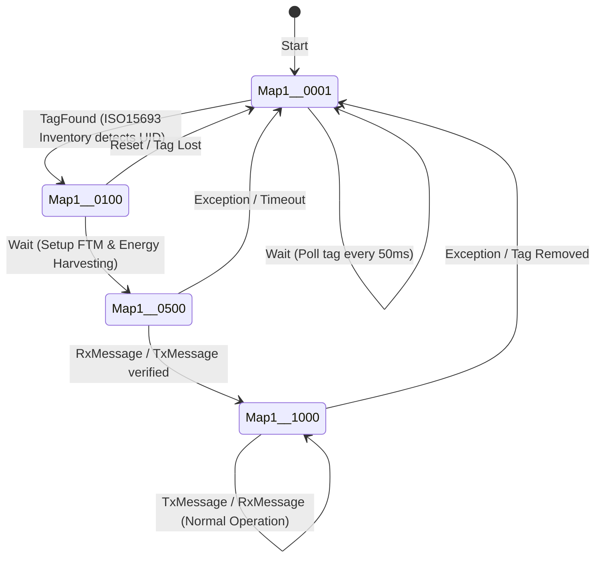

# Learning Module 02: AdvNFC Protocol & State Machine Engine

## 1. Executive Summary
`AdvNFC.dll` implements the core communication protocol between the host application and the embedded microcontroller driving the E-paper display (EPD). It features an SMC (State Machine Compiler) driven asynchronous state engine, packet framing with checksum verification, ST25DV mailbox synchronization, and flash streaming commands.

---

## 2. Packet Framing & Checksum Calculation

### Transmission Packet Layout (`buildNFCPacket`)
```
+--------------+-------------+-----------------------+--------------------+
| Command (1B) | Length (1B) | Payload (Length Bytes)| Checksum (1 Byte)  |
| [CMD]        | [LEN]       | [DATA 0 .. LEN-1]     | [CS]               |
+--------------+-------------+-----------------------+--------------------+
```

### Checksum Mathematical Formula
The checksum is an 8-bit additive 2's complement value ensuring the modular sum of the entire packet equals zero:
$$\text{CS} = (256 - (\text{CMD} + \text{LEN} + \sum_{i=0}^{\text{LEN}-1} \text{DATA}[i])) \pmod{256}$$

### Response Validation (`checkChecksum`)
Upon receiving `recv` array from tag mailbox:
$$(\sum_{b \in \text{recv}} b) \pmod{256} == 0$$

- **`recv[0]`**: Echoed Command Code
- **`recv[1]`**: Status Byte (`1` = Success / ACK, `0` = Error / NACK)
- **`recv[2 .. N-2]`**: Response Payload (if any)
- **`recv[N-1]`**: Checksum Byte

---

## 3. Complete Command Set Specification (`LeoD30EPDAPI`)

| Command Name | Hex Code | Dec Code | Payload In | Payload Out | Description |
| :--- | :--- | :--- | :--- | :--- | :--- |
| `CMD_VERSION` | `0xF0` | 240 | None | `[Major, Minor]` or `[Major, Minor, Build]` | Queries EPD tag firmware version string |
| `CMD_PLATFORM_NAME`| `0xF1`| 241 | None | 12 ASCII Characters | Queries model name (e.g., `"EPD-210    "`) |
| `CMD_GET_SN` | `0xF6` | 246 | None | 12 Hex Bytes | Queries tag manufacturing serial number |
| `CMD_BOOT_TO_LOADER`| `0xF4`| 244 | `[Mode]` | Status ACK | Reboots device into OTA Bootloader mode |
| `CMD_ERASE_IMAGE_FLASH`| `0x80`| 128 | `[lz4flag (1B)]` | Status ACK | Erases image flash sector; sets LZ4 decompression mode |
| `CMD_WRITE_IMAGE_FLASH_NOACK`| `0x8E`| 142 | `[Offset (4B)][Chunk (NB)]`| None (Streaming)| Streams image data chunk without per-packet round-trip ACK |
| `CMD_CHECK_IMAGE_FLASH`| `0x82`| 130 | None | Status ACK | Instructs MCU to calculate and verify flash CRC |
| `CMD_END_WRITE_FLASH_AND_EPD`| `0x85`| 133 | `[Pages, Width(2B), Height(2B)]` | Status ACK | Finalizes flash write and triggers physical E-paper refresh |
| `CMD_GET_EPD_STATUS`| `0x88`| 136 | None | Status ACK (`1` = Idle, `0` = Refreshing)| Polls whether e-paper update waveform is complete |
| `CMD_WRITE_USER_DATA_FLASH`| `0x83`| 131 | `[Data (up to 256B)]`| Status ACK | Writes arbitrary non-volatile user data |
| `CMD_READ_USER_DATA_FLASH`| `0x84`| 132 | `[Offset (2B)]`| User Data Bytes | Reads non-volatile user data from flash |
| `CMD_PINGCODE_STATUS`| `0xA0`| 160 | None | `[Status (1B)]` | Checks if PIN protection is active |
| `CMD_PINCODE_UNLOCK`| `0xA1`| 161 | `[PIN (4B)]` | Status ACK | Unlocks protected tag operations with 4-byte PIN |
| `CMD_PINCODE_SET` | `0xA3` | 163 | `[New PIN (4B)]`| Status ACK | Configures new 4-byte access PIN |
| `CMD_PINCODE_RESET`| `0xA2` | 162 | `[Master Key (8B)]`| Status ACK | Resets forgotten PIN using master key |

---

## 4. Finite State Machine Architecture (`NFCStateContext`)

The connection and protocol lifecycle is managed via an SMC-compiled state machine:



### State Definitions
1. **`Map1._0001` (Init / Polling)**:
   - State: `NFCSTATE_NONE`.
   - Action: Periodically issues ISO 15693 Inventory commands.
   - Transition: When tag responds, fires `NFCTagState.NFC_TAG_STATE_TAG_ON` and moves to `_0100`.
2. **`Map1._0100` (Setup FTM)**:
   - State: `NFCSTATE_INIT`.
   - Action: Configures ST25DV `DYN_ADDR_EH_CTRL` (`0x02` = Energy Harvesting enable) and `DYN_ADDR_MB_CTRL` (`0x0D` = Fast Transfer Mode Mailbox Enable).
3. **`Map1._0500` (Test Communication)**:
   - State: `NFCSTATE_TEST`.
   - Action: Performs mailbox handshake by checking `MB_CTRL_BIT_MB_EN` and testing RF/Host mailbox flags.
4. **`Map1._1000` (Ready / Operational)**:
   - State: `NFCSTATE_READY`.
   - Action: Sets `CommEnable = true`, fires `NFCTagState.NFC_TAG_STATE_COMM_ON`. Ready to transmit image data and handle application commands.
