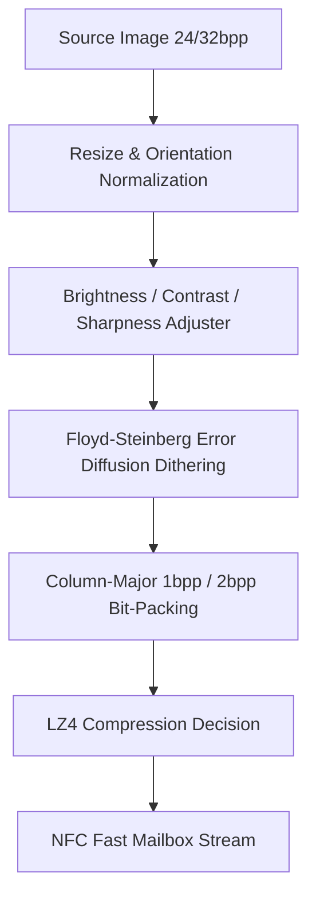

# Learning Module 07: Image Processing, Bit-Packing & Dithering Pipeline

## 1. Overview
E-paper displays have unique physical characteristics: they are bistable or multi-stable electrophoretic displays that operate with 1 bit per pixel (Black/White) or 2 bits per pixel (B/W/Red/Yellow). Transforming high-color 24/32-bit images into pristine e-paper bitmaps requires a specialized mathematical pipeline.

---

## 2. The 5-Stage Image Transformation Pipeline

---

## 3. Mathematical Operations

### Step 1: Brightness & Contrast Adjustment
$$\text{RGB}_{\text{adj}} = \text{clamp}\left( \left( \text{RGB} - 128 \right) \times \text{ContrastFactor} + 128 + \text{BrightnessOffset}, 0, 255 \right)$$

### Step 2: Floyd-Steinberg Error Diffusion Dithering
For each pixel at coordinate $(x, y)$:
1. Find nearest color $C_{\text{nearest}}$ in target palette (Euclidean distance in RGB space):
   $$\Delta E = \sqrt{(R - R_p)^2 + (G - G_p)^2 + (B - B_p)^2}$$
2. Calculate quantization error vector:
   $$\text{Error} = C_{\text{original}} - C_{\text{nearest}}$$
3. Diffuse error to neighboring pixels:
   - $(x+1, y) \leftarrow + \frac{7}{16} \times \text{Error}$
   - $(x-1, y+1) \leftarrow + \frac{3}{16} \times \text{Error}$
   - $(x, y+1) \leftarrow + \frac{5}{16} \times \text{Error}$
   - $(x+1, y+1) \leftarrow + \frac{1}{16} \times \text{Error}$

---

## 4. EPD Display Memory Layout & Bit-Packing

### 1-Bit B/W Panels (EPD-210 / EPD-302)
- **Scanning Order**: Vertical column-major 8-pixel bytes.
- **Horizontal Reversal**: Column $X_{\text{sample}} = \text{Width} - 1 - i$.
- **Bit Mapping**:
  - White Pixel = Bit Value `1`
  - Black Pixel = Bit Value `0`
- **Byte Assembly**:
  $$\text{Byte}[X, Y/8] = \sum_{k=0}^7 (\text{Pixel}[\text{Width}-1-X, Y+k] == \text{White} ? 1 : 0) \ll (7 - k)$$

### 4-Color Panels (EPD-304 / EPD-37)
2 bits per pixel (4 pixels per byte):
- **Black (`b`)**: `0b00` (0)
- **White (`w`)**: `0b01` (1)
- **Yellow (`y`)**: `0b10` (2)
- **Red (`r`)**: `0b11` (3)

---

## 5. LZ4 Compression Integration
Before transmission, `AdvNFC` runs LZ4 block compression on the raw bit-packed array:
- If $\text{Size}_{\text{LZ4}} < \text{Size}_{\text{Raw}}$, `lz4flag = 1`, and the compressed byte stream is transmitted.
- If compressed size is larger (e.g. high-frequency noisy dithered patterns), `lz4flag = 0`, and the raw array is streamed directly.
